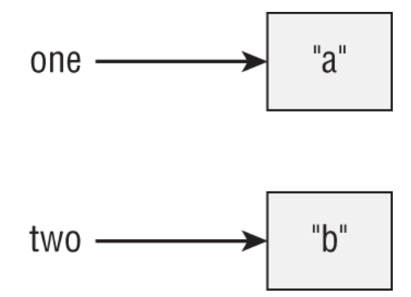
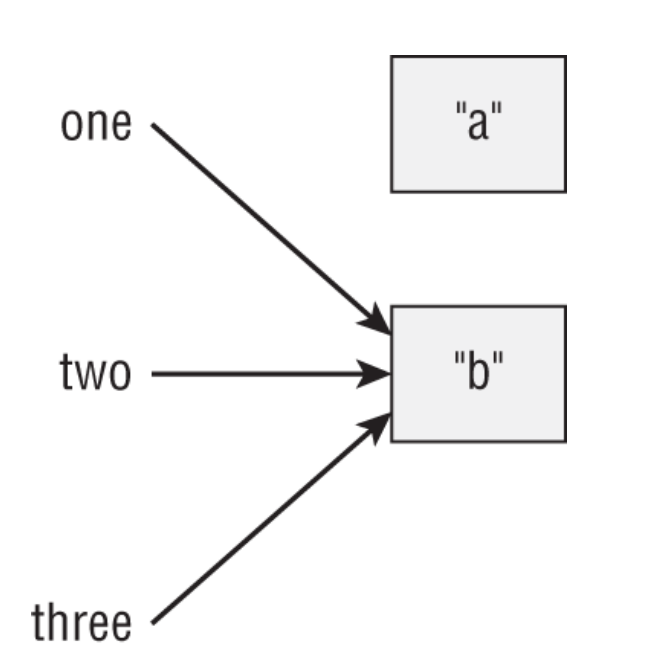
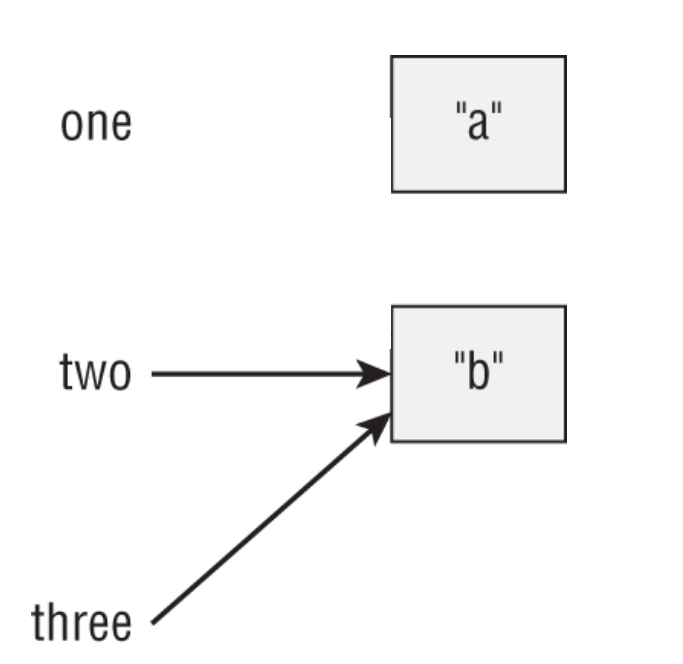

# Destroying Objects

## Section Content

<!-- TOC -->
* [Destroying Objects](#destroying-objects)
  * [Garbage Collection (GC)](#garbage-collection-gc)
  * [Tracing Eligibility](#tracing-eligibility)
<!-- TOC -->

All Java objects are stored in your program memory’s _heap_. The
heap, which is also referred to as the _free store_, represents a large
pool of unused memory allocated to your Java application. If your
program keeps instantiating objects and leaving them on the heap,
eventually it will run out of memory and crash. Oh, no! Luckily, JVM takes care of that for you.
Java provides a garbage collection who solves this problem.

## Garbage Collection (GC)

Garbage collection is the automatic process of freeing heap memory 
by removing objects that are no longer **reachable** in a program.
While Java uses various GC algorithms, 
their details are **not required for the exam**.

An object is **eligible for garbage collection** when 
it is no longer accessible by any live reference.  
⚠️ Being eligible **does not mean** the object will be immediately
collected—the timing is **not under the developer’s control**.

For the OCP exam, the key skill is identifying **which objects are 
eligible for GC at a given moment**.

Java provides:
```java
System.gc();
```

## Tracing Eligibility
The JVM determines garbage collection eligibility by checking
whether an object is still **reachable**. An object remains 
on the heap as long as it can be accessed through a reference.

An object becomes **eligible for garbage collection** when:
- It has **no references** pointing to it, or
- **All references** to it have gone **out of scope**

Understanding the difference between a **reference** and 
an **object** is essential for GC questions.

For exam questions, it’s highly recommended to 
**draw reference diagrams** to track objects and avoid mistakes 
when determining GC eligibility.


```java
public class Scope {
    public static void main(String[] args) {
        String one, two;
        one = new String("a");
        two = new String("b");
        one = two;
        String three = one;
        one = null;
    } 
}
```
these figures explain how the initialization of each variable
in this code snippet and when the Objects are ready to be garbage collected 

1. Two references point to two different objects.  
   `one` references `"a"` and `two` references `"b"`.  
   Both objects are reachable and **not eligible** for garbage collection.



2. `one` is reassigned to reference `"b"`, and a new reference `three` also points to `"b"`.  
   The object `"a"` now has **no references**, making it **eligible for garbage collection**.



3. `one` no longer references any object, while `two` and `three` still reference `"b"`.  
   The object `"b"` remains reachable and becomes eligible for garbage collection **only when all references go out of scope**.


